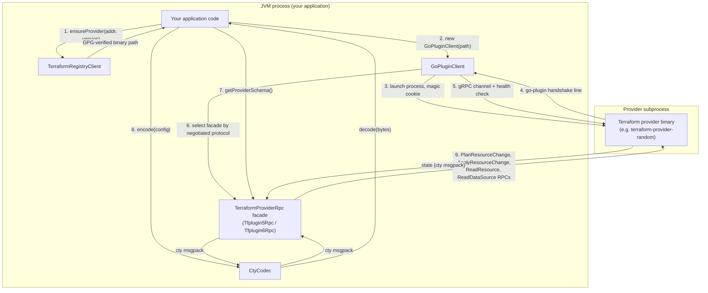

# tfplugin-jvm

[](LICENSE)
[](https://openjdk.org/)
[](https://github.com/kitecorp/tfplugin-jvm/issues/2)

A **JVM client for the Terraform plugin protocol**. It launches any Terraform
provider plugin, completes the go-plugin handshake, negotiates `tfplugin5` vs
`tfplugin6`, and drives the provider's resources and data sources over gRPC —
all from Java (or any JVM language).

It speaks only Terraform's wire protocol. It is provider-agnostic and has no
dependency on Terraform core, OpenTofu, or any particular consumer.

## Why this exists

HashiCorp publishes the plugin protocol, but the tooling that *drives* a
provider — the **client** side — ships only inside Terraform/OpenTofu, in Go.
The client role is not even packaged as a standalone Go library:
[hashicorp/terraform#32769](https://github.com/hashicorp/terraform/issues/32769)
("gRPC client library similar to hashicorp/terraform-plugin-go") is an open
request for exactly that, still unresolved.

Pulumi's Java SDK does not speak `tfplugin` either. It reaches Terraform
providers indirectly: Pulumi's own RPC protocol talks to a Go-based bridge
process (`pulumi-resource-terraform-provider` /
`pulumi-terraform-bridge`), which is what actually drives the provider binary.
No JVM code in that path ever performs the go-plugin handshake or speaks
tfplugin5/6 directly — `tfplugin-jvm` does, from Java, with no Go process of
its own to maintain.

As of 2026, `tfplugin-jvm` appears to be the only JVM implementation of the
Terraform provider *client* protocol in existence. It was extracted from the
[Kite](https://kitelang.cloud) engine's `terraform-bridge`, which uses it to run
the entire Terraform provider ecosystem underneath Kite's own IaC language.

## Architecture

Everything left of the process boundary below is this library, running
in-process with your application. The only external process is the Terraform
provider binary itself — there is no sidecar, no Go code to maintain, and no
indirection through another RPC protocol.



1. **`TerraformRegistryClient`** resolves a provider address (e.g.
   `hashicorp/random`) and version constraint against
   `registry.terraform.io`, downloads the release zip, and verifies its
   `SHA256SUMS` file against the registry-advertised GPG signing key before
   the extracted binary is ever trusted or executed.
2. **`GoPluginClient`** launches that binary as a subprocess with the
   go-plugin magic-cookie environment variables, reads its handshake line off
   stdout (`CORE_PROTO|APP_PROTO|NETWORK_TYPE|NETWORK_ADDR|PROTOCOL`), dials a
   gRPC channel to the announced address, and confirms the provider is
   `SERVING` via the gRPC health check before handing back a usable client.
3. The handshake's negotiated app protocol (5 or 6) selects the
   `TerraformProviderRpc` implementation — `Tfplugin5Rpc` or `Tfplugin6Rpc` —
   transparently; callers only ever see the version-agnostic facade.
4. Every RPC (`getProviderSchema`, `configure`, `planResourceChange`,
   `applyResourceChange`, `readResource`, `importResourceState`,
   `readDataSource`) exchanges cty-typed payloads as msgpack bytes;
   **`CtyCodec`** is what translates those bytes to and from plain Java
   `Map<String, Object>` on the application side of the call.
5. `close()` (or exiting the try-with-resources block) sends the provider a
   `Stop` RPC, shuts the gRPC channel down, and terminates the subprocess.

## What it does

| Concern | Type |
|---|---|
| Protocol versions 5 and 6, negotiated automatically from the go-plugin handshake — no user configuration | `GoPluginClient` |
| go-plugin handshake, subprocess lifecycle, health check | `GoPluginClient` |
| Version-agnostic RPC facade (one API over tfplugin5 **and** tfplugin6) | `TerraformProviderRpc` (`Tfplugin5Rpc` / `Tfplugin6Rpc`) |
| cty ⇄ Java encoding (`DynamicValue` msgpack, incl. unknown/null ext types) | `CtyCodec` |
| Neutral schema model (blocks, attributes, nested types, diagnostics) | `TfSchema`, `TfBlock`, `TfAttribute`, `TfObjectType`, `TfNestedBlock`, `TfDiagnostic`, `TfAttributePath` |
| Schema-version upgrade handling — re-encodes state written under an older provider schema into the current one | `TerraformProviderRpc.upgradeResourceState` |
| Registry download + SHA256SUMS + detached-OpenPGP signature verification, fail-closed | `TerraformRegistryClient`, `OpenPgpSignatureVerifier` |
| Per-call gRPC deadlines — a short tier for control-plane calls, a generous multi-hour tier for cloud-touching resource operations | `RpcDeadlines`, `RpcDeadlineInterceptor` |

The tfplugin5/tfplugin6 `.proto` sources ship with the library; their gRPC stubs
are generated at build time.

## Quick start — create a `random_pet` with hashicorp/random

This example downloads the real `hashicorp/random` provider, launches it, and
creates a `random_pet` resource — no credentials required. It has been run
end to end against the live `registry.terraform.io` and a real provider
binary (see verification notes in kitecorp/tfplugin-jvm#3).

```java
import cloud.kitelang.tfplugin.CtyCodec;
import cloud.kitelang.tfplugin.GoPluginClient;
import cloud.kitelang.tfplugin.TerraformProviderRpc;
import cloud.kitelang.tfplugin.TerraformRegistryClient;

import java.nio.file.Path;
import java.util.LinkedHashMap;

public class RandomPetExample {
    public static void main(String[] args) throws Exception {
        // 1. Download hashicorp/random from the public registry. The ZIP's
        //    SHA256SUMS and its detached GPG signature are verified against the
        //    registry-advertised signing key before the binary is trusted.
        var registry = new TerraformRegistryClient(
                Path.of(System.getProperty("user.home"), ".cache/tfplugin-jvm"));
        Path providerBinary = registry.ensureProvider("hashicorp/random", null); // null = latest

        // 2. Launch the provider and complete the go-plugin handshake. The app
        //    protocol version (5 or 6) is negotiated and hidden behind the facade.
        try (var client = new GoPluginClient(providerBinary)) {
            TerraformProviderRpc tf = client.rpc();
            System.out.println("negotiated tfplugin" + client.getAppProtocolVersion());

            // 3. random has an empty provider config block.
            var codec = new CtyCodec();
            tf.configure(codec.encode(new LinkedHashMap<>(), "[\"object\",{}]"));

            // 4. The cty type of a random_pet's state/config. In real code, derive
            //    this from tf.getProviderSchema().resourceSchemas().get("random_pet").
            var petType = "[\"object\",{"
                    + "\"keepers\":[\"map\",\"string\"],"
                    + "\"length\":\"number\",\"prefix\":\"string\","
                    + "\"separator\":\"string\",\"id\":\"string\"}]";

            var desired = new LinkedHashMap<String, Object>();
            desired.put("length", 2);
            desired.put("separator", "-");
            desired.put("keepers", null);
            desired.put("prefix", null);
            desired.put("id", null);            // computed — unknown until apply
            byte[] config = codec.encode(desired, petType);

            // 5. Plan (prior state is cty-nil for a create), then apply. A cty nil
            //    MUST be encoded bytes — codec.encode(null, type) packs a single
            //    msgpack nil — never a raw Java `null` byte[] reference (that skips
            //    the codec entirely and reaches the gRPC layer as an invalid payload).
            byte[] nilState = codec.encode(null, petType);
            var plan = tf.planResourceChange("random_pet",
                    nilState, config, config, new byte[0]);
            var applied = tf.applyResourceChange("random_pet",
                    nilState, plan.plannedState(), config, plan.plannedPrivate());

            var state = codec.decode(applied.state(), petType);
            System.out.println("created random_pet.id = " + state.get("id"));
        }
    }
}
```

Running it prints something like:

```
negotiated tfplugin5
created random_pet.id = tops-skylark
```

`priorState`, `config`, and every state payload are cty msgpack byte arrays.
A cty null is the msgpack nil encoding — produce it with `codec.encode(null,
type)`, never an empty array and never a raw Java `null` reference (the
latter reaches the gRPC layer unencoded and throws).

## Install

Not yet published to Maven Central — tracked in
[kitecorp/tfplugin-jvm#2](https://github.com/kitecorp/tfplugin-jvm/issues/2).
Until then, consume it as a git submodule with a local Gradle dependency
substitution (this is how the Kite workspace builds it), or `./gradlew
publishToMavenLocal` and depend on `cloud.kitelang:tfplugin-jvm:0.1.0`.

```groovy
// Gradle, once published
implementation 'cloud.kitelang:tfplugin-jvm:0.1.0'
```

```xml
<!-- Maven, once published -->
<dependency>
  <groupId>cloud.kitelang</groupId>
  <artifactId>tfplugin-jvm</artifactId>
  <version>0.1.0</version>
</dependency>
```

The build already configures Maven Central publishing (`maven-publish` +
`signing` + JReleaser's Central Portal deploy, mirroring kite-cli's
mechanism) — `./gradlew publishToMavenCentral` is wired but the first real
release is a manual owner step: it needs secrets that are deliberately not
committed to this repo. To cut the first release, a maintainer must add
these under this repo's Settings > Secrets and variables > Actions, then run
the `Publish tfplugin-jvm to Maven Central` workflow
(`.github/workflows/publish-maven-central.yml`) via `workflow_dispatch`:

| Secret | Purpose |
|---|---|
| `MAVEN_USERNAME` | Sonatype Central Portal token username (from central.sonatype.com/account) |
| `MAVEN_PASSWORD` | Sonatype Central Portal token password |
| `GPG_PUBLIC_KEY` | Armored ASCII public key: `gpg --armor --export YOUR_KEY_ID` |
| `GPG_PRIVATE_KEY` | Armored ASCII private key: `gpg --armor --export-secret-keys YOUR_KEY_ID` |
| `GPG_PASSPHRASE` | GPG key passphrase (empty string is fine if the key has none) |

A verified `cloud.kitelang` namespace on the
[Sonatype Central Portal](https://central.sonatype.com) is also required,
once, outside of any secret.

## Build

Requires JDK 21 (Gradle toolchain; auto-provisioned).

```bash
./gradlew build   # compile + protocol tests
./gradlew test    # tests only
```

## License

Apache-2.0.
